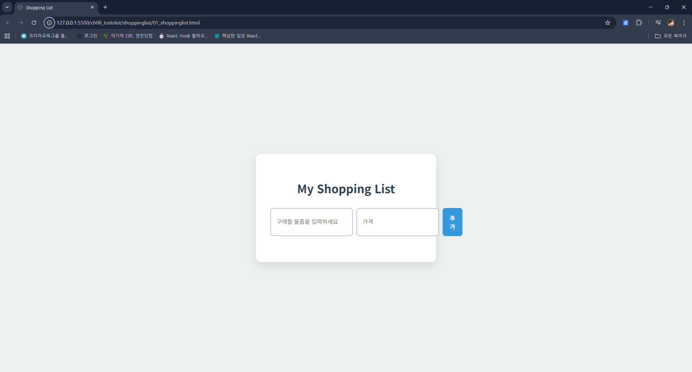

# JavaScript 주요 Web API
## API란?
Application Programming Interface의 축약어로 응용 프로그램이나 시스템이 서로 통신하고 상호작용가능하게 돕는 인터페이스

비유적으로 식당에서 손님(클라이언트)이 주문(요청)을 하면 주방(서버)에 전달하고 주방에서 요리(데이터 처리)를 완성하면 손님에게 전달하는 웨이터 역할

person 객체에 fName / lName이라는 재료를 가지고 fullName을 만들어 내는 등의 처리를 했는데 

## API의 구성 요소
1. 명세(Specification) : API가 제공하는 기능 목록과 사용 방법을 정의하는 문서
2. 인터페이스(Interface) : 실제로 통신을 위한 규익. 주로 HTTP 프로토콜을 사용

## Web API
웹 애플리케이션 개발에 사용되는 API로 웹 서버와 클라이언트(웹 브라우저 / 모바일 앱 등) 같은 통신을 가능하게

### 특징
1. HTTP 프로토콜 기반 : 웹에서 데이터를 주고 받을 때 사용하는 방식
2. RESTful API : 최근에 가장 널리 사용되는 웹 API 스타일로 HTTP 메서드를 사용해 데이터를 처리하는 방식
3. 데이터 형식 : 주로 JSON 사용. 혹은 XML(extensible markup language)

### LocalStorage / SessionStorage
- HTML5에서 추가된 웹 브라우저 자체 저장소
1. LoacalStorage
  - 저장된 데이터를 삭제하기 전까지 영구보존ㄴ
  - 저장되는 모든 데이터는 JS의 object처럼 key-value properties로 구성
  - value의 자료형은 string으로 고정
  - 이러한 이유로 다양한 자료형의 데이터를 저장할 때 JSON.stringfy를 이용해 문자열로 변환시켜 저장
  - 반대로 LocalStorage 내의 데이터를 불러와서 웹페이지에 출력하려면 JSON.parse를 이용해 원래 데이터 형식으로 변환해야 함
  - 보안에 위배되지 않고 영구히 저장해도 상관없는 데이터를 저장할 때 적합
    - 사용자가 마지막으로 보고 있는 화면 url
    - 웹 사이트에서 사용자 테마, 개인화를 제공하는 경우 해당 정보 저장

```js
// localStorage에 문자열 데이터와 배열 데이터를 저장하는 예시

if (typeof Storage !== 'undefined') { // Storage가 검색됬으니 문제 없음
  localStorage.setItem('title', 'review : 파이팅');
  /*
    .setItem() 라는 메서드가 있고 거기에 2개의 argument를 집어넣기
    두 번째 매개변수인 value 값은 원래 string 자료형이면 그대로
  */

  // 집어넣을 데이터 예시 - JS 배열인데 내부 element가 객체 -> String으로의 변환 과정 필요
  const users = [
    {
      id: 1,
      name: '김일'  
    }, {
      id: 2,
      name: '김이'
    },
  ];
  localStorage.setItem('users', JSON.stringify(users))
}
```

1. 코드 라인에서 확인할 부분은 Java의 getter / setter가 동일하게 적용됨
2. localStorage 상의 key-value의 자료형이 둘 다 고정되어있기에 value가 string 이외의 다른 자료형이면 변환 과정 필요
  - 변환을 위해 method는 JSON.stringfy(바꿀려는 데이터);
  - live server 사용 중이기에 그냥 연동하면 자동적용

localStorage 상에 데이터가 저장되면 같은 도메인 내의 다른 페이지에서도 저장된 데이터를 조회 할 수 있음(A 사이트의 로그인 창에 id/비밀번호 입력하고 authentication 적용하면 A 사이트 내의 다른데서도 이용 가능하듯)

```js
// localStorage 내에 있는 데이터를 조회하는 예시
if (Storage !== undefined) {
  console.log(localStorage.getItem('title'));
  console.log(localStorage.getItem);
  // 이 경우 26 / 27번 라인의 자료형 결과값들은 전부 string
  // 그래서 27번 라인을 string으로 쓸거면 별 문제가 없지만 굳이 객체정보로 저장한걸 string으로 쓸 리가 없으니 원상복구하는 method가 필요
  console.log(JSON.parse(localStorage.getItem('users')));

  const userFromLocal = JSON.parse(localStorage.getItem('users'));
  console.log(userFromLocal[0].name);
}

// 삭제 예시
localStorage.removeItem('title');
```

사실상 localStorage에서 알아야 할 것은 
  1. setItem('키, 값') / getItem('키') / removeItem('키'); 메서드 3가지
  2. value로 들어가는 데이터의 자료형
    - string이면 그대로
    - 아니면 JSON.stringify() 사용
  3. getItem 사용시 localStorage에 들어가있는 value들은 전부 string이니 
    - string은 그대로 가지고오고
    - 원래 형태가 string이 아니러면([] / {} 로 시작하는 등) JSON.parse('키') 사용

2. sessionStorage
- 세션 스토리지에 저장된 데이터는 브라우저를 닫으면 자동 삭제
- method 명 동일
- 저장 방식이 동일해서 JSON.stringify() / JSON.parse()를 동일하게 사용

# TodoList 작성
## 요구사항 명세서
1. 개요(Introduction)
이 문서는 사용자가 효율적으로 관리할 수 있도록 돕는 todo 리스트 웹 애플리케이션의 요구 사항 명세. 사용자가 할 일을 추가, 관리 삭제 기능을 제공하며 웹 브라우저의 `localStorage`를 활용해 데이터를 영구 저장

2. 기능 요구사항(Functional Requirments)
- 할 일 추가(Add To-Do) :
  - 사용자는 텍스트 입력창(`<input>` 태그)에 할 일을 입력하고 추가 버튼을 클릭하거나 enter로 할 일을 목록에 추가할 수 있어야 함
  - 입력된 텍스트는 공백을 제거하고 저장
  - 입력 내용이 비어있으면 사용자에세 경고 메세지 표시
  - 새로 추가할 일은 완료되지 않음 상태로 추가

- 할 일 표시(Display To-Do) :
  - 추가된 할 일은 순서대로 목록에 표시
  - 각 할일 항목에는 체크박스, 할 일 내용, 삭제버튼이 포함

- 할 일 상태 변경(Change To-Do Status) :
  - 사용자는 각 할 일 옆의 체크 박스를 클릭해 해당 할 잉의 완료 상태를 변경 가능하게 해야 함
  - 완료됨 상태의 할 일은 시각적으로 구분되게 취소건과 흐릿한 색상 적용

- 데이터 영구 저장(Data Persistence) :
  - 애플리케이션은 브라우저의 `localStorage`를 활용해 목록 데이터를 저장
  - 페이지를 새로고침하거나 브라우저를 닫았다가 열어도 기존의 할 일 유지

3. 기술 요구 사항(Technical Requriment)
  - 언어 및 기술 :
    - HTML / CSS / JavaScript를 사용. 외부 라이브러리나 프레임워크는 사용하지 않음
    - JavaScript 내장 객체 및 메서드를 사용
      - JSON 객체 
      - Array 객체 
      - String 객체

    - DOM 조작 :
      - document.getElementById()를 사용해 HTML element를 선택
      - 기타 다른 document 관련 method를 활용

    - 이벤트 처리 :
      - addEventListner()를 사용해 click 이벤트와 keydown 이벤트를 처리
      - 체크박스의 change 이벤트도 처리해 할 일의 완료 상태 업데이트

  - 디자인 및 사용자 경험(UX) :
    - 직관적 디자인과 사용자 친화적 레이아웃 제공
    - 모바일 기기에서도 사용 가능하게 반응형 디자인 적용
    - 할 일 추가, 상태 변경. 삭제시 시각적 효과로 사용자가 즉각적 피드백 가능케 하기

## CSS 변수 명세서
1. 색상(Colors) : 
- 프로젝트의 주요 색상을 정의
  - --primary-color : #2c3e50
    - 용도 : 주요 텍스트, 제목 등 핵심요소에 사용되는 기본 색상

  - --secondary-color : #3498db
    - 용도 : 상호작용 가능한 요소(버튼 / 링크 등)나 강조를 위한 색상

  - --light-gray : #bdc3c7
    - 용도 : 비활성화요소나 경계선(border) 등 
    보족적 요소에 사용되는 밝은 회색

  - --completed-color : #95a5a6
    - 용도 : 완료된 할 일 텍스트에 사용 색상

2. 폰트(Typograpgy)
- 프로젝트 글 꼴 정의
  - --font-family : Noto Sans KR, sans-sherif
    - 용도 : 전체 애플리케이션에 사용되는 기본 글꼴

3. 레이아웃 및 간격 (Layout / Spacing)
- 컴포넌트의 크기와 간격 정의
  - --container-padding : 2.5rem
    - 용도 : 메인 컨테이너의 내부 여백
  - --container-radius : 15px
    - 용도 : 개별 할 일 아이템의 내부 여백
  - --item-radiys : 8px
    - 용도 : 입력창, 버튼, 할 일 아이템의 모서리 둥글기
  - --gap : 10px
    - 용도 : 입력 그룹 내 요소간의 간격

4. 그림자(Shadows)
- 입체감을 위한 그림자 효과 정의
  - --conatiner-shadow : 0 10px 225px rgba(0, 0, 0, 0.1)
    - 용도 : 메인 컨테이너에 적용되는 그림자
  - --item-hover-shadow : 0 5px 15px rgba(0, 0 ,0, 0.05)
    - 용도 : 할 일 아이템에 마우스를 올릴때 적용하는 그림자

### 예제 1: 할일 리스트 만들기
```html
1. 01_todolist.html

<!DOCTYPE html>
<html lang="ko">
<head>
  <meta charset="UTF-8">
  <meta name="viewport" content="width=device-width, initial-scale=1.0">
  <title>Todo List 실습</title>
  <link rel="stylesheet" href="01_todolist.css">
  <script src="01_todolist.js" defer></script>
</head>
<body>
  <div class="todo-container">
    <h1>나의 ToDo List</h1>
    <div class="input-group">
      <input type="text" id="todo-input" placeholder="새로운 할 일을 추가하세요">
      <button id="add-btn">추가</button>
    </div>
    <ul id="todo-list" class="todo-list">
      <!-- 버튼을 눌렀을 때 <li> 태그 추가 -->
        <!-- html에는 있지만 새 사이트에는 없음. 사이트를 켜면 renderTodos()가 호출도니느데 localStorage 저장된것만 출력하게 작성 -->
        <li class="todo-item">
          <input type="checkbox" class="completed">
          <span class="todo-text">todolist 만들기</span> 
          <button class="delete-btn">삭제</button>
        </li>
    </ul>
  </div>
</body>
</html>
```
```css
2. 01_todolist.css

@import url('https://fonts.googleapis.com/css2?family=Noto+Sans+KR:wght@400;700&display=swap');

:root {
  --primary-color : #2c3e50;
  --secondary-color : #3498db;
  --background-color : #ecf0f1;
  --light-gray : #bdc3c7;
  --completed-color : #95a5a6;
  --font-family : 'Noto Sans KR', 'sans-sherif';

}

body {
  font-family: var(--font-family);
  background-color: var(--background-color);
  display: flex;
  justify-content: center;
  align-items: center;
  min-height: 100vh;
  margin: 0;
  color: var(--primary-color);
}

.todo-container {
  background: #ffffFF;
  padding: 2.5rem;
  border-radius: 15px;
  box-shadow: 0 10px 25px rgb(0, 0, 0, 0.1);
  width: 100%;
  max-width: 500px;
  box-sizing: border-box;
}

h1 {
  text-align: center;
  color: var(--primary-color);
  margin: 2rem;
}

.input-group {
  display: flex;
  gap: 10px;
  margin-bottom: 2rem;
}

.input-group input {
  flex-grow: 1;
  border: 2px solid var(--light-gray);
  border-radius: 8px;
  padding: 15px;
  font-size: 1rem;
  transition: border-color 0.3s;
}

.input-group input:focus {
  outline: none;
  border-color: var(--secondary-color);
}

.input-group button {
  padding: 15px 20px;
  background-color: var(--secondary-color);
  color: #ffffFF;
  border: none;
  border-radius: 8px;
  cursor: pointer;
  font-size: 1rem;
  font-weight: bold;
  transition: --background-color 0.3s, transform 0.1s;
}

.input-group button:hover {
  background-color: #2980b9;
}

.input-group button:active {
  transform: scale(0.98);
}

.todo-list {
  list-style: none;
  padding: 0;
  margin: 0;
}

.todo-item {
  display: flex;
  align-items: center;
  padding: 15px;
  background: #f7f9fa;
  border-radius: 8px;
  margin-bottom: 10px;
  transition: transform 0.3s ease, box-shadow 0.3s ease;
}

.todo-item:hover {
  transform: translate(-3px);
  box-shadow: 0 5px 15px rgba(0,0,0,0.5);
}

.todo-item.completed {
  background-color: #e8eaed;
}

.todo-item.completed .todo-text {
  text-decoration: line-through;
  color: var(--completed-color);
}

.todo-item input[type="checkbox"] {
  margin-right: 15px;
  cursor: pointer;
  width: 20px;
  height: 20px;
}

.todo-text {
  flex-grow: 1;
  font-size: 1.1rem;
}

.todo-item .delete-btn {
  background: none;
  border: none;
  color: var(--light-gray);
  font-size: 1.1rem;
  cursor: pointer;
  transition: color 0.3s;
}

.todo-item .delete-btn:hover {
  color: #e74c3c;
}

@media (max-width: 600px) {
  .todo-container {
    padding: 1.5rem;
    border-radius: 0;
    min-height: 100vh;
  }
}
```
```js
3. 01_todolist.js

<!DOCTYPE html>
<html lang="ko">
<head>
  <meta charset="UTF-8">
  <meta name="viewport" content="width=device-width, initial-scale=1.0">
  <title>Todo List 실습</title>
  <link rel="stylesheet" href="01_todolist.css">
  <script src="01_todolist.js" defer></script>
</head>
<body>
  <div class="todo-container">
    <h1>나의 ToDo List</h1>
    <div class="input-group">
      <input type="text" id="todo-input" placeholder="새로운 할 일을 추가하세요">
      <button id="add-btn">추가</button>
    </div>
    <ul id="todo-list" class="todo-list">
      <!-- 버튼을 눌렀을 때 <li> 태그 추가 -->
        <!-- html에는 있지만 새 사이트에는 없음. 사이트를 켜면 renderTodos()가 호출도니느데 localStorage 저장된것만 출력하게 작성 -->
        <li class="todo-item">
          <input type="checkbox" class="completed">
          <span class="todo-text">todolist 만들기</span> 
          <button class="delete-btn">삭제</button>
        </li>
    </ul>
  </div>
</body>
</html>
```

### 예제 2: 쇼핑 리스트 만들기

작성이 다 됬다고 가정하면 현재 01_shoppingList.html에 01_tododlist.css를 도입



이런 문제점이 생기는데 가장 쉬운 해결법은

1. 01_shoppinglist.css를 만들고 01_todolist.css의 코드를 복사해 수정
  - 수정 중 에러로 다른 코드 까지 깨짐 막기 위함
2. 01_shoppinglist.css를 만들지만 모듈화를 적용

```html
1. 01_shoppingList.html


```
```css
2. 01_shoppingList.css


```
```js
3. 01_shoppingList.js


```